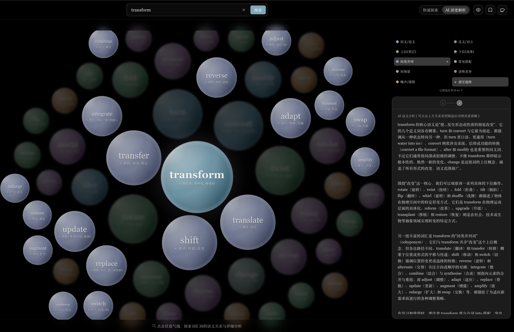
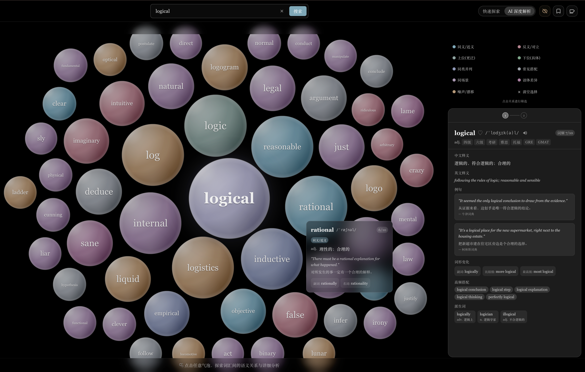

# Voc Gravity

**将词汇的语义空间可视化为引力气泡场**

*Visualize the semantic space around any word as an interactive bubble graph*

[](LICENSE)
[](http://43.156.159.38/)

**在线体验 →** http://43.156.159.38/ &nbsp;*(域名申请中)*

---

<!-- 截图 1：快速探索模式，毫秒级响应 -->


<!-- 截图 2：AI 深度解析模式，渐进式关系着色 -->


<!-- 截图 3：AI 深度解析模式，语义关系筛选与分析流式输出 -->


<!-- 截图 2：背诵 -->

---

## 为什么做这个 / The story behind this

我是一名 ADHDer，思维跳跃，大脑天生抗拒线性的词汇表。
面对传统背单词软件，我总陷入一种无力感：很多词明明似曾相识（形近、义近，或存在某种模糊的关联），但我却摸不透它们之间的确切边界。背了忘，忘了背，这片语义空间对我来说始终是个黑盒。
于是我写了 Voc Gravity。它用 AI 模拟了我的非线性思维：将一个词置于中心，让相关的词汇像受引力吸引般在周围展开，把抽象的关联变成可视化的力导向气泡。
最核心的体验在于“动态生长”：点击屏幕上的任意一个单词，系统会以它为新原点，实时拉扯出下一层语义网络。你的每一次点击，都在这片未知的词汇空间中铺展出一条只属于你的探索路径。

虽然内置了雅思词库，但这套架构是完全解耦的——只需要一份词表和你的 API Key，你就能为任何语言、任何领域构建同样的语义引力场。

I am an ADHDer. My mind jumps across concepts and naturally resists linear, A-to-Z vocabulary lists.
Traditional language apps always left me frustrated. I kept encountering words that felt vaguely familiar—similar in spelling, close in meaning, or conceptually linked—but I could never pin down their exact boundaries. Memorize, forget, repeat. The semantic space remained a black box.
So I built Voc Gravity to simulate how my brain actually works: put a word at the center, and let AI pull in its semantic neighbors using a force-directed layout. It turns invisible relationships into a visual, interactive bubble field.
The real magic happens when you click. Select any word in the network, and it instantly becomes the new center, dynamically expanding a fresh layer of semantic branches. Your clicks carve out an infinite, personalized path of exploration.

While it ships with an IELTS vocabulary, the architecture is completely agnostic—bring your own word list and API key, and you can generate this exact semantic gravity field for any language.

---

## 功能 / Features

| | |
|--|--|
| **语义气泡场** | FAISS 向量检索（text-embedding-3-large, 3072维），D3 力导向布局，同心圆四层展示 |
| **快速探索模式** | 纯向量检索，按词性着色，无 LLM 调用，毫秒响应 |
| **AI 深度解析** | DeepSeek 将邻域词归类为 9 种语义关系并附解释，SSE 流式推送 |
| **回忆模式** | 一键隐藏中文，只看英文气泡，用于词汇记忆练习 |
| **探索路径** | 面包屑记录跳跃路径，支持任意节点回撤 |
| **收藏 & 历史** | 本地持久化，随时回顾感兴趣的词 |
| **词库外词汇** | 搜索未收录词时，LLM 实时生成并缓存到本地 |
| **Token 计费** | 内置用量追踪，精确到每次调用的费用明细 |

**9 种语义关系**：synonym · antonym · hypernym · hyponym · cohyponym · collocation · register · frame · noise

---

## 快速部署 / Quick Start

### 前置条件

- Python 3.10+，Node.js 18+
- **Embedding API Key**（用于 FAISS 向量检索）：推荐 `text-embedding-3-large`（3072 维，召回精度高），OpenAI 或兼容接口均可；换其他 embedding 模型同样支持，但需删除旧索引重建
- **LLM API Key**（用于语义关系分析 + 词汇生成）：任意 OpenAI 兼容接口均可

  | 提供商 | 模型推荐 | API 兼容 |
  |--------|----------|----------|
  | [OpenAI](https://platform.openai.com/) | gpt-4o-mini | ✅ 原生 |
  | [DeepSeek](https://platform.deepseek.com/) | deepseek-chat | ✅ 兼容 |
  | [阿里云百炼 / Qwen](https://bailian.console.aliyun.com/) | qwen-plus | ✅ 兼容 |
  | [智谱 GLM](https://open.bigmodel.cn/) | glm-4-flash | ✅ 兼容 |
  | [月之暗面 Kimi](https://platform.moonshot.cn/) | moonshot-v1-8k | ✅ 兼容 |

  修改 `backend/core/semantic.py` 和 `backend/core/generate_vocabulary.py` 中的 `base_url`、`model`、`api_key` 即可切换。

### 启动

```bash
git clone https://github.com/WenXiaoWendy/voc-gravity.git
cd voc-gravity

# 配置 API Key（填入你选择的提供商的 Key）
echo "OPENAI_API_KEY=sk-..."        >> .env   # Embedding 用
echo "DEEPSEEK_API_KEY=sk-..."      >> .env   # LLM 用（或改名为对应提供商的变量）

# 一键启动（自动创建 venv、安装依赖、启动前后端）
./start.sh
```

访问 http://localhost:3000

<details>
<summary>手动启动</summary>

```bash
# 后端（终端 1）
python3 -m venv venv && source venv/bin/activate
pip install -r backend/requirements.txt
cd backend/api && python app.py

# 前端（终端 2）
cd frontend && npm install && npm run dev
```

</details>

---

## 扩展到其他语言 / Extend to Any Language

这是本项目最核心的能力。只需三步，即可为任意语言构建同款语义探索工具。

**Step 1 — 准备词表**

在 `backend/data/` 创建词库 JSON，格式如下：

```json
[
  { "id": "001", "word": "abandon", "pos": "v", "chinese_gloss": "放弃" }
]
```

`chinese_gloss` 字段可替换为任意目标语言的释义。

**Step 2 — 批量生成完整词汇信息**（推荐）

内置脚本会为每个词调用 LLM，批量生成发音、例句、搭配、派生词等，进度自动保存，中断可续跑：

```bash
source venv/bin/activate
cd backend
python -m core.batch_generate_all --book your_book_key
```

**Step 3 — 重建 FAISS 索引**

修改 `backend/core/retrieval.py` 中的 `book_key`，删除旧索引目录 `backend/faiss_index/`，重启后端，索引自动重建。

---

## API 参考 / API Reference

| Method | Endpoint | 说明 |
|--------|----------|------|
| GET | `/api/health` | 健康检查 |
| POST | `/api/retrieve` | 向量检索 + 可选 LLM 分析（非流式） |
| POST | `/api/retrieve-stream` | 向量检索 + LLM 分析（SSE 流式推送） |
| POST | `/api/validate-word` | 验证词汇合法性（Free Dictionary API） |
| POST | `/api/generate-word` | 触发单词词汇信息生成 |
| GET | `/api/token-stats` | 用量与费用统计 |
| GET | `/api/token-stats?date=2026-03-09` | 按日期查询 |

`/api/retrieve-stream` 响应格式（SSE）：

```
data: {"type": "words", "words": [...]}      # 气泡数据，立即推送
data: {"type": "analysis", "analysis": {...}} # LLM 分析，流式追加
data: {"type": "done"}
```

---

## 架构简述 / Architecture

```
voc-gravity/
├── backend/
│   ├── api/app.py                  # Flask 入口
│   └── core/
│       ├── retrieval.py            # FAISS 向量检索
│       ├── semantic.py             # LLM 语义关系分析
│       ├── token_stats.py          # Token 用量追踪
│       ├── validate.py             # 新词验证
│       └── batch_generate_all.py   # 批量词汇生成脚本 ← 核心工具
└── frontend/src/
    ├── components/                 # React 组件
    └── utils/
        ├── layout.ts               # D3 力导向布局（四层同心圆）
        └── theme.ts                # 莫兰迪配色
```

**核心设计**：
- 气泡分四层：center(1) · inner(7) · middle(16) · outer(32)，相似度决定大小
- 快速模式与 AI 模式分离，通过 `include_analysis` 参数控制 LLM 调用
- FAISS 索引首次启动时自动构建；切换 embedding 模型需删除并重建索引

---

## 生产部署 / Production

```bash
# 构建前端
cd frontend && npm run build

# 启动后端
source venv/bin/activate
gunicorn -w 2 -b 0.0.0.0:8000 "backend.api.app:app"
```

Nginx 关键配置：

```nginx
location / { try_files $uri $uri/ /index.html; }
location /api/ { proxy_pass http://127.0.0.1:8000; }
gzip on; gzip_types application/json text/plain;
```

---

## License

MIT © [WenXiaoWendy](https://github.com/WenXiaoWendy)

---

*如果这个工具对你有帮助，欢迎 Star ⭐ 或通过页面右上角 ☕ 请我喝杯咖啡。*
